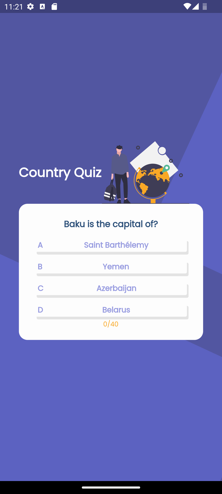
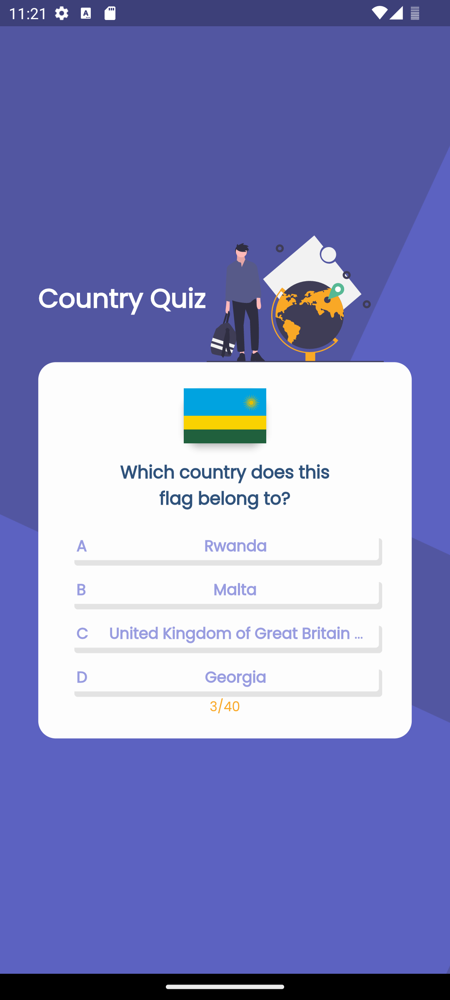

# Quiz App

Test your geography skills with 40 random questions selected from a database of 235 countries. Identify countries by their flags or capitals, challenge your knowledge, and learn while having fun.

## Gif Showcase

  

## Screenshots

<table align="center">
  <tr>
    <td style="padding: 0 10px;">
      
    </td>
    <td style="padding: 0 10px;">
      
    </td>
    <td style="padding: 0 10px;">
      
    </td>
  </tr>
</table>